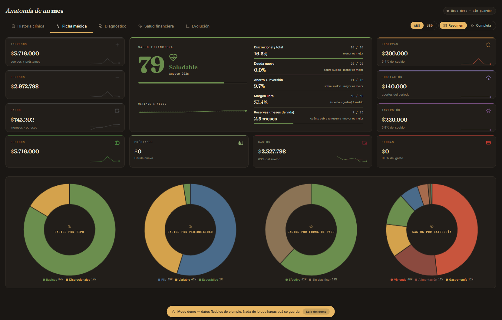
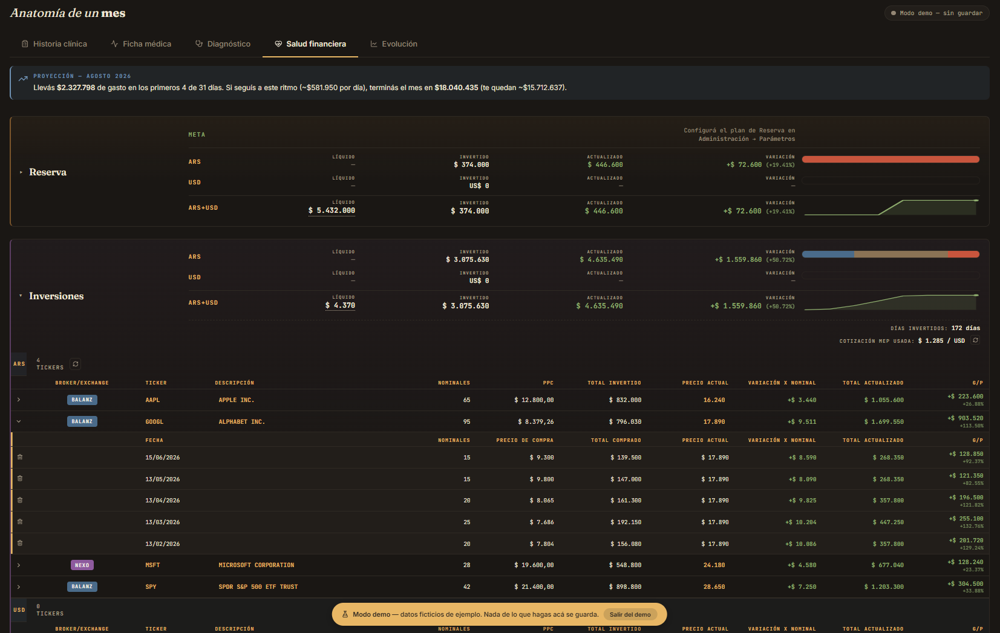

# anamnesis

**Diagnóstico financiero personal.** Un dashboard que trata tus finanzas como una historia clínica: registra los síntomas, mide los signos vitales y arriesga un diagnóstico.

Pensado para el contexto argentino: pesos y dólares conviviendo, cotización MEP, CEDEARs, inflación que hace que comparar dos meses sin ajustar no signifique nada.

---

## Por qué existe

Las apps de finanzas personales suelen fallar en lo mismo: te piden las credenciales del banco, guardan tus movimientos en un servidor ajeno y te devuelven una torta de colores que no te dice qué hacer.

anamnesis parte de tres decisiones opuestas:

- **Tus datos son tuyos y se quedan en tu Drive.** No hay backend, no hay cuenta, no hay servidor que los vea. La app lee y escribe un `.json` que vos elegís, mediante la File System Access API del navegador.
- **La categorización es el producto.** Importás el resumen del banco tal como lo bajás —CSV o Excel, sin pasarlo por ningún lado— y la app aprende a clasificar tus movimientos, con reglas explícitas primero y aprendizaje sobre tu propio historial después.
- **Un número, no un tablero.** El score de salud financiera resume cinco dimensiones en un valor de 0 a 100, para que sepas si vas bien sin tener que interpretar seis gráficos.

## Cómo se ve



**Ficha médica** — el score de salud financiera con sus cinco componentes, los KPIs del período y la distribución del gasto por tipo, periodicidad, forma de pago y categoría.



**Salud financiera** — la cartera por destino, con líquido e invertido separados por moneda. Cada activo se despliega en sus compras individuales, y cada compra muestra cómo le fue contra el precio de hoy.

**▶ Probalo en vivo: [anamnesis-7zs.pages.dev](https://anamnesis-7zs.pages.dev/)** — entrá con "Ver demo con datos de ejemplo", no hace falta conectar nada.

**📄 [Manual de usuario (PDF)](docs/manual-de-usuario.pdf)** — 15 páginas con una captura de cada pantalla y para qué sirve.

_Las dos capturas son del modo demo: los números son ficticios._

## Probarlo

No hace falta instalar nada ni tener datos propios: abrí `dashboard.html` y hacé clic en **"Ver demo con datos de ejemplo"**.

Eso carga un dataset ficticio de 573 transacciones sobre 14 meses —sueldos con inflación, aguinaldos, alquiler, supermercado, aportes jubilatorios y una cartera de 10 CEDEARs— generado en memoria. El modo demo **no escribe absolutamente nada**: ni en tu disco, ni en `localStorage`, ni sale a la red.

Para usarlo con datos reales necesitás Chrome o Edge (la File System Access API no está en Firefox ni Safari) y servirlo por HTTP o abrirlo como archivo local.

## Las cinco solapas

La metáfora médica no es decorativa: cada solapa responde una pregunta distinta.

| Solapa | Pregunta que responde |
|---|---|
| **Historia clínica** | ¿En qué se fue la plata? Movimientos del período, recategorizables, con etiquetas y formas de pago. |
| **Ficha médica** | ¿Cómo estoy hoy? KPIs configurables, score de salud, distribución por categoría, tipo, periodicidad y medio de pago. |
| **Diagnóstico** | ¿Qué está pasando? Flujo trimestral, evolución anual e insights automáticos. |
| **Salud financiera** | ¿Cuánto tengo? Reserva, inversiones, trading y jubilación, con precios actualizados desde el mercado. Cada activo se despliega en sus compras individuales, con el rendimiento de cada una contra el precio de hoy. |
| **Evolución** | ¿Estoy mejorando? Presupuestado contra real, mes a mes, con tendencias por categoría. |

## Importar los resúmenes

Subís el archivo tal como lo bajás del banco —CSV o Excel— y la app lo lee sola. **Mercado Pago** y **Banco Galicia** vienen configurados, pero cualquier entidad se puede agregar desde la propia app: subís un resumen de ejemplo, marcás cuál es la fila de títulos, decís qué columna es cada cosa y ves el resultado antes de guardar.

Ese último paso es el que importa. Mapear columnas a ciegas es adivinar, y el error típico —leer `03/04` como 3 de abril cuando era 4 de marzo— no se nota hasta tener meses de movimientos mal cargados. El preview muestra las transacciones reales que saldrían con la configuración actual.

Los formatos incorporados también se editan, por si esas entidades cambian cómo generan sus archivos; tu versión reemplaza a la de la app y podés volver a la original cuando quieras.

**Cargas parciales sin duplicar.** Podés subir el resumen del 1 al 10 y después el del 8 al 20: las transacciones que se repiten se descartan solas. Y si entre una carga y otra le corregiste la descripción, el monto o la fecha a una transacción, se sigue reconociendo como la misma —la clave de deduplicación es la que tenía en el archivo del que salió, no la que muestra la pantalla.

## Decisiones técnicas

**Vanilla, sin build step.** HTML, CSS y JavaScript sin frameworks ni bundler. Se abre con doble clic y funciona. Las únicas dependencias externas van por CDN: Chart.js y Lucide para gráficos e íconos, más html2canvas y jsPDF que se cargan diferidos y solo intervienen al exportar. Es una decisión deliberada: una herramienta personal que quiero que siga andando dentro de cinco años no puede depender de una cadena de build que se pudre en seis meses.

**El navegador como runtime completo.** La persistencia usa la File System Access API contra un archivo que elige el usuario, con el handle guardado en IndexedDB para reconectar entre sesiones y guardado con debounce. No hay backend porque no hace falta.

**Funciones puras aisladas y testeadas.** `core.js` concentra la lógica de cálculo sin estado —parseo de números en formato argentino, clasificación de categorías, motor de KPIs, cálculo del score, migración de esquemas, parseo de resúmenes bancarios— y `tests.html` la cubre con **331 tests** en 40 grupos, incluidos casos de integración de un trimestre completo. Es un mini-framework propio de unas 70 líneas —`group`, `test` y cuatro aserciones— que corre en el navegador y no necesita Node.

**Cada banco es un dato, no código.** Los parsers de Mercado Pago y Galicia eran el mismo algoritmo con constantes distintas, así que ese algoritmo vive una sola vez y cada entidad es una plantilla: qué columna trae la fecha, si el importe viene firmado o partido en débito y crédito, en qué formato están los números. Ocho campos cubren los dos bancos reales, y el motor trabaja sobre filas, así que da igual que el archivo sea CSV o Excel.

**Categorización en dos etapas.** Primero las reglas explícitas del usuario (`contains`, `exact`, `starts`, `regex`), y para lo que no matchea, un clasificador token-based que aprende de los últimos meses ya categorizados. Lo que el usuario corrige a mano se convierte en insumo del clasificador.

**Aritmética con signo explícito.** Todos los montos se guardan positivos y el signo lo aplica cada operación (`+ Sueldo − gastos − Inversión…`). Suena menor, pero es lo que permite que una misma transacción cuente distinto según el KPI que la mire.

## Estructura

```
dashboard.html    3.026 líneas    estructura, modales, formularios
dashboard.css     7.679 líneas    estilos y theming claro/oscuro
dashboard.js     21.438 líneas    lógica, render, estado, importación
core.js           2.445 líneas    funciones puras + motor de plantillas
demo-data.js        508 líneas    generador del dataset de demostración
tests.html        2.994 líneas    331 tests sobre core.js
```

## Correr los tests

Abrí `tests.html` en el navegador. No requiere Node, ni instalación, ni servidor.

Para validar sintaxis antes de commitear:

```bash
node --check dashboard.js
```

## Regenerar las capturas

Si la interfaz cambia, las de `docs/` se rehacen así:

1. Abrí `dashboard.html` y entrá al modo demo.
2. Capturá **Ficha médica** y **Salud financiera** (en Chrome: `Ctrl+Shift+P` → "Capture screenshot").
3. Pisá `docs/ficha-medica.png` y `docs/salud-financiera.png`.

Siempre desde el modo demo: así las capturas no exponen información real.

## Estado

Proyecto personal en uso activo. La versión actual persiste contra Google Drive; está en evaluación migrar la capa de persistencia a una base de datos, manteniendo ambos backends detrás de una interfaz común.

Lo que sigue pendiente: la categorización automática no se configura por entidad. Un banco nuevo importa bien, pero sus movimientos caen sin categoría hasta que las reglas y el historial aprenden. Es un problema distinto al de leer el archivo y todavía no está resuelto.

## Licencia

Sin licencia definida — todos los derechos reservados. El código está publicado para consulta.
