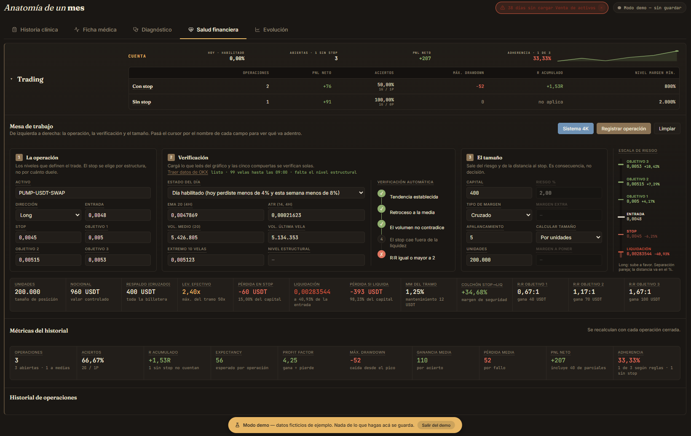

# anamnesis

**Diagnóstico financiero personal.** Un dashboard que trata tus finanzas como una historia clínica: registra los síntomas, mide los signos vitales y arriesga un diagnóstico.

Pensado para el contexto argentino: pesos y dólares conviviendo, cotización MEP, y precios de CEDEARs que se actualizan solos —incluidos los tickers en dólares, que salen del CEDEAR en pesos aplicando su ratio.

---

## Por qué existe

Las apps de finanzas personales suelen fallar en lo mismo: te piden las credenciales del banco, guardan tus movimientos en un servidor ajeno y te devuelven una torta de colores que no te dice qué hacer.

anamnesis parte de tres decisiones opuestas:

- **Tus datos son tuyos y se quedan en tu Drive.** No hay backend, no hay cuenta, no hay servidor que los vea. La app lee y escribe un `.json` que vos elegís, mediante la File System Access API del navegador.
- **La categorización es el producto.** Importás el resumen del banco tal como lo bajás —CSV o Excel, sin pasarlo por ningún lado— y la app aprende a clasificar tus movimientos, con reglas explícitas primero y aprendizaje sobre tu propio historial después.
- **Un número, no un tablero.** El score de salud financiera resume cinco dimensiones en un valor de 0 a 100, para que sepas si vas bien sin tener que interpretar seis gráficos.

## Cómo se ve


**Ficha médica** — el score del período en el centro, con sus cinco componentes desagregados y en qué dirección conviene mover cada uno. Alrededor, las tarjetas de indicadores y, abajo, los anillos que reparten el gasto por tipo, periodicidad, forma de pago y categoría.


**Salud financiera** — el patrimonio repartido por destino, con el líquido y lo invertido separados por moneda y la variación contra el precio de hoy. En la tabla, cada activo con sus nominales, su precio promedio de compra y su resultado; los que ya se vendieron enteros quedan marcados como liquidados, con lo que dejaron.



**Mesa de trading** — la operación, la verificación de las cinco compuertas y el tamaño de posición que sale del riesgo, uno al lado del otro. Debajo, la fila de números que el exchange no muestra junta: liquidación, pérdida en stop, colchón hasta la liquidación y R:R de cada objetivo.

_Las tres capturas son del modo demo: los números son ficticios._

## Cómo funciona

La metáfora médica no es decorativa: cada solapa responde una pregunta distinta.

| Solapa | Pregunta que responde |
|---|---|
| **Historia clínica** | ¿En qué se fue la plata? Movimientos del período, recategorizables, con etiquetas y formas de pago. Dos vistas: **Resumen**, una fila por categoría con su peso sobre el total, y **Completa**, cada movimiento editable en su fila. |
| **Ficha médica** | ¿Cómo estoy hoy? KPIs configurables, score de salud, distribución por categoría, tipo, periodicidad y medio de pago. También en dos vistas: **Completa** con todos los gráficos, y **Resumen** con las secciones que elijas dejar. |
| **Diagnóstico** | ¿Qué está pasando? Flujo trimestral, evolución anual e insights automáticos. |
| **Salud financiera** | ¿Cuánto tengo? Reserva, inversiones y las dos jubilaciones, con precios actualizados desde el mercado. Cada activo se despliega en sus compras individuales, con el rendimiento de cada una contra el precio de hoy, y se puede **vender** entero o por partes. Trading va último y aparte: es la [mesa de operaciones](#la-mesa-de-trading). |
| **Evolución** | ¿Estoy mejorando? Presupuestado contra real, mes a mes, con tendencias por categoría. |

### Importar los resúmenes

Subís el archivo tal como lo bajás del banco —CSV o Excel— y la app lo lee sola. **Mercado Pago** y **Banco Galicia** vienen configurados, pero cualquier entidad se puede agregar desde la propia app: subís un resumen de ejemplo, marcás cuál es la fila de títulos, decís qué columna es cada cosa y ves el resultado antes de guardar.

Ese último paso es el que importa. Mapear columnas a ciegas es adivinar, y el error típico —leer `03/04` como 3 de abril cuando era 4 de marzo— no se nota hasta tener meses de movimientos mal cargados. El preview muestra las transacciones reales que saldrían con la configuración actual.

Los formatos incorporados también se editan, por si esas entidades cambian cómo generan sus archivos; tu versión reemplaza a la de la app y podés volver a la original cuando quieras.

**Cargas parciales sin duplicar.** Podés subir el resumen del 1 al 10 y después el del 8 al 20: las transacciones que se repiten se descartan solas. Y si entre una carga y otra le corregiste la descripción, el monto o la fecha a una transacción, se sigue reconociendo como la misma —la clave de deduplicación es la que tenía en el archivo del que salió, no la que muestra la pantalla.

### La mesa de trading

Trading era el único destino de la cartera que no encajaba con lo que la pantalla mostraba. Una tenencia es una compra que se acumula y se valúa contra el precio de hoy. Una operación apalancada es otra cosa: un viaje completo —entrada, stop, salida— con apalancamiento, precio de liquidación, comisiones y funding, que termina con un resultado definitivo. Valuarla como si fuera un CEDEAR no dice nada.

Así que Trading dejó de listar tickers y su panel pasó a ser una mesa de gestión de riesgo. Antes de abrir una operación calcula lo que el exchange no te muestra junto: el tamaño de posición que sale del riesgo que elegiste, el precio de liquidación real —con los tramos de margen de mantenimiento, no la fórmula de manual—, cuánto se evapora si te liquidan, y si la liquidación pega antes que tu stop, en cuyo caso el stop es decorativo.

Cada operación pasa por cinco compuertas —tendencia, retroceso a la media, volumen, stop fuera de la liquidez y R:R mínimo de 2— y queda registrado cuáles pasó. Eso es lo que después permite separar **el sistema que no funciona del sistema que no ejecutaste**: la adherencia se mide contra lo que te habías propuesto, no contra el resultado.

El historial compara las operaciones **con stop contra las que fueron sin stop** —cantidad, PnL neto, win rate, drawdown, R acumulado y nivel de margen mínimo— porque ahí es donde se ve si operar sin stop te está saliendo bien o simplemente todavía no te salió mal. Las que van sin stop no muestran R: sin stop no hay unidad de riesgo, y poner cero sería mentir, porque cero R significa salir en break-even.

El reglamento completo se consulta desde la propia mesa, sin salir del dashboard.

Las tres secciones —mesa de trabajo, métricas e historial— vienen plegadas. Abiertas de entrada el panel medía varias pantallas y había que scrollear hasta el fondo para llegar al historial, que es lo que más se mira.

La demo trae seis operaciones de ejemplo elegidas para mostrar los casos límite: con stop y sin stop, abiertas, parciales y cerradas, long y short, salida por objetivo, por stop y a mano, y una que cierra en dos tramos. Una de las que va sin stop cierra **en ganancia**, a propósito: ganar no valida el proceso.

## Decisiones técnicas

- **Vanilla, sin build step.** HTML, CSS y JavaScript sin frameworks ni bundler, que se abre con doble clic y funciona. Las únicas dependencias externas van por CDN: Chart.js y Lucide para gráficos e íconos, html2canvas y jsPDF que solo intervienen al exportar, y SheetJS, que se descarga la primera vez que subís un Excel y no antes. Es una decisión deliberada: una herramienta personal que quiero que siga andando dentro de cinco años no puede depender de una cadena de build que se pudre en seis meses.

- **El navegador como runtime completo.** La persistencia usa la File System Access API contra un archivo que elige el usuario, con guardado por debounce para no escribir en cada tecla. El handle queda en IndexedDB, así que la app reconecta sola con el mismo archivo en la sesión siguiente y solo hay que elegirlo una vez. No hay backend porque no hace falta.

- **Funciones puras aisladas y testeadas.** `core.js` concentra la lógica de cálculo sin estado: parseo de números en formato argentino, clasificación de categorías, motor de KPIs, cálculo del score, migración de esquemas y parseo de resúmenes bancarios. `tests.html` la cubre con **380 tests** en 46 grupos, incluidos casos de integración sobre un trimestre completo. Es un mini-framework propio de unas 70 líneas —`group`, `test` y cuatro aserciones— que corre en el navegador y no necesita Node.

- **Cada banco es un dato, no código.** Los parsers de Mercado Pago y Galicia eran el mismo algoritmo con constantes distintas, así que ese algoritmo vive una sola vez y cada entidad es una plantilla. Ocho campos alcanzan para describir un resumen: qué columna trae la fecha, si el importe viene firmado o partido en débito y crédito, en qué formato están los números, qué filas hay que ignorar. El motor trabaja sobre filas, así que da igual que el archivo sea CSV o Excel.

- **Categorización en dos etapas.** Primero corren las reglas explícitas del usuario, que matchean sobre la descripción con `contains`, `exact`, `starts` o `regex` y tienen prioridad absoluta. Lo que ninguna regla cubre pasa a un clasificador que aprende de lo que ya categorizaste: si vio la descripción exacta la repite, y si no, vota por palabras y solo se anima cuando una categoría se lleva la mayoría. Lo que corregís a mano se convierte en insumo de ese clasificador.

- **Una regla vale si hace algo.** Además de clasificar, una regla puede **descartar** —para la basura que traen los resúmenes: saldos anteriores, avisos, líneas de corte— o **renombrar**, porque `MERPAGO*STARBUCKS 0034512` no se lee. El descarte corre antes de categorizar y deduplicar, así lo descartado nunca entra y tampoco ensucia el aprendizaje. El renombre guarda la descripción original en el tooltip y no rompe la deduplicación, porque la clave se fija al parsear con el texto del archivo y el renombre ocurre después.

- **Vender es sacar de las compras más viejas.** Un activo se liquida entero desde su fila o por partes desde una compra del detalle, y en el primer caso la cantidad se descuenta de las tandas más antiguas primero. Eso no es un capricho de orden: el costo de lo vendido sale del precio de cada compra, y de ahí depende cuánta ganancia realizaste. Cada venta deja además un movimiento con la fecha de la liquidación —Renta financiera o Pérdida financiera—, así el resultado aparece en el flujo del mes y no solo en la cartera.

- **Aritmética con signo explícito.** Todos los montos se guardan positivos, sin excepción, y el signo lo aplica cada operación según su semántica (`+ Sueldo − gastos − Inversión…`). Suena menor, pero es lo que permite que una misma transacción cuente distinto según el KPI que la mire. La devolución de capital es el caso que lo justifica: resta en el balance de flujo, porque es plata que salió del bolsillo.

### Estructura

```
dashboard.html    3.131 líneas    estructura, modales, formularios
dashboard.css     7.786 líneas    estilos y theming claro/oscuro
dashboard.js     22.216 líneas    lógica, render, estado, importación
core.js           2.653 líneas    funciones puras + motor de plantillas
mesa-trading.js   2.985 líneas    mesa de trading: riesgo, liquidación, historial
mesa-trading.css  1.029 líneas    estilos de la mesa
sistema-4k.js       478 líneas    el reglamento de trading, consultable en la app
demo-data.js        724 líneas    generador del dataset de demostración
tour.js             302 líneas    el recorrido guiado del modo demo
tour.css            131 líneas    estilos del recorrido
tests.html        3.299 líneas    380 tests sobre core.js
```

### Correr los tests

Abrí `tests.html` en el navegador. No requiere Node, ni instalación, ni servidor.

Para validar sintaxis antes de commitear:

```bash
node --check dashboard.js
```

## Estado

Proyecto personal en uso activo. La versión actual persiste contra Google Drive; está en evaluación migrar la capa de persistencia a una base de datos, manteniendo ambos backends detrás de una interfaz común.

## Licencia

Sin licencia definida — todos los derechos reservados. El código está publicado para consulta.

## Probarlo

No hace falta instalar nada ni tener datos propios.

**▶ La app en vivo: [anamnesis-7zs.pages.dev](https://anamnesis-7zs.pages.dev/)** — entrá con "Ver demo con datos de ejemplo", no hace falta conectar nada.

También podés bajarte el repo y abrir `dashboard.html` —servido por HTTP o como archivo local—: es el mismo botón.

La demo carga un dataset ficticio de 574 transacciones sobre 14 meses —sueldos con inflación, aguinaldos, alquiler, supermercado, aportes jubilatorios, una cartera de 10 CEDEARs comprados en 19 tandas, una venta parcial y seis operaciones en la mesa de trading— generado en memoria. El modo demo **no escribe absolutamente nada**: ni en tu disco, ni en `localStorage`. Y no hace ninguna llamada por su cuenta: los auto-refrescos de cotización y precios están desactivados, así la demo se ve siempre igual. Sólo sale a la red si vos apretás actualizar precios o traer datos de mercado, y en ese caso pide precios públicos sin mandar nada tuyo.

Arranca solo un **recorrido guiado** de once pasos que va oscureciendo la pantalla e iluminando de qué habla: el panel lateral, cada solapa y las acciones de carga y administración. Se corta cuando quieras —con el botón de salir, la cruz, `Escape` o un clic afuera— y se vuelve a lanzar desde **RECORRIDO**, al final del panel lateral. Justo debajo, **MANUAL** abre el PDF adentro de la app, sin salir de la pantalla donde estabas.

> [!WARNING]
> **Para usarlo con datos reales necesitás Chrome o Edge.** La File System Access API, que es con la que la app escribe tu archivo, no existe en Firefox ni en Safari. El modo demo sí funciona en cualquier navegador.

**📄 [Manual de usuario (PDF)](docs/manual-de-usuario.pdf)** — índice navegable, una captura de cada pantalla y para qué sirve cada una.

**📋 [Especificación funcional](docs/especificacion-funcional.md)** — cada funcionalidad, el modelo de datos, las reglas de negocio, las integraciones y los formatos.
